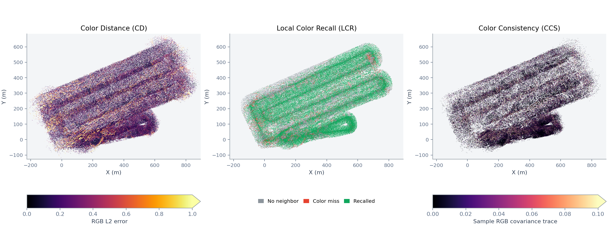

# Color-Map-Evaluation

[](https://ieeexplore.ieee.org/abstract/document/11399876)
[](https://arxiv.org/abs/2511.01186)

A standalone toolkit for evaluating the color quality of reconstructed 3D maps,
with metrics from **LiDAR-VGGT: Cross-Modal Coarse-to-Fine Fusion for Globally
Consistent and Metric-Scale Dense Mapping** (*IEEE Robotics and Automation Letters*, 2026).

| Metric | Measures | Reference required | Better |
| --- | --- | --- | --- |
| Color Distance / Fidelity (CD / CF) | RGB error at bidirectional spatial nearest neighbors; CF expresses CD in dB | Yes | CD ↓ / CF ↑ |
| Local Color Recall (LCR) | Fraction of reference points with a nearby, color-compatible reconstructed point | Yes | ↑ |
| Color Consistency Score (CCS) | Mean sample RGB covariance trace within occupied voxels | No | ↓ |



Example visualizations on AMtown02: reconstruction-to-reference color error,
reference recall status, and color variance in voxels containing at least two points.

[Metric definitions](docs/metrics.md) · [Advanced usage](docs/usage.md) · [LiDAR-VGGT reconstruction](https://github.com/NorwegianSmokedSalmon/LiDAR-VGGT)

## Installation

Requires **Python 3.10–3.12**. Evaluation runs on CPU; no GPU or ROS installation is required.

```bash
git clone https://github.com/NorwegianSmokedSalmon/Color-Map-Evaluation.git
cd Color-Map-Evaluation
python -m venv .venv
source .venv/bin/activate
python -m pip install '.[plot]'
```

For numerical evaluation without plots, install with `python -m pip install .`.

## Quick Start

Inputs are colored **PLY / PCD** files with coordinates in meters and RGB channels
in Open3D's `[0, 1]` convention. The reconstruction and reference must share the
same coordinate frame. Use the reconstructed map **before voxel color averaging**
to preserve the color statistics needed by CCS.

```bash
color-map-evaluate \
  --map reconstruction.ply \
  --reference reference.ply \
  --tau 0.1 --radius 0.5 --ccs-voxel-size 0.1 \
  --output results/run/metrics.json \
  --visualization-dir results/run/visualizations \
  --progress
```

This evaluates all three metric families and exports a JSON report, PNG plots,
colored PLY files, and NPZ diagnostic data. Use a new visualization directory for
each run. To compute CCS alone, omit `--reference` and add `--metrics ccs`.

To try the complete workflow without downloading a dataset:

```bash
python examples/make_toy_clouds.py
color-map-evaluate --config examples/evaluation.json
```

The example produces LCR **0.8** and CCS **0.02**.
`python -m color_map_evaluation` provides the same command line interface.

## Visualization

| Output | Description |
| --- | --- |
| `color_distance.png`, `cd_*.ply` | Color-error maps in both nearest-neighbor directions |
| `recall.png`, `lcr_reference_status.ply` | Green: recalled; red: color mismatch; gray: no geometric neighbor |
| `lcr_pairs_reference.ply`, `lcr_pairs_map.ply` | Eligible reference/reconstruction pairs in their original colors |
| `lcr_pair_lines.ply`, `lcr_pairs.npz` | Example connecting lines and exact pair indices, spatial distances, and color errors |
| `color_consistency.png`, `ccs_voxels.ply` | Per-voxel color variance, with singleton voxels shown in gray |
| `color_consistency_supported.png`, `ccs_supported_voxels.ply` | Color variance in voxels with at least two points |

Open PLY files in **CloudCompare** or **Open3D**. Matching row numbers in the two
LCR pair clouds form correspondences; one reconstructed point may appear in
multiple pairs. NPZ files preserve unclipped values and point indices.

Visualization exports contain at most **200,000 points per cloud** by default.
This limit affects display only: **metrics use every supplied point**. Control
sampling with `--visualization-max-points` and `--visualization-seed`.

## Configuration

Copy [examples/evaluation.json](examples/evaluation.json), set your input and
output paths, and run:

```bash
color-map-evaluate --config path/to/evaluation.json
```

Paths in the JSON resolve relative to the config file. Explicit command line
arguments override the configuration.

The defaults use an LCR radius of **0.5 m**, an RGB L2 threshold of **3 × 0.1**, and
a CCS voxel size of **0.1 m**. Singleton voxels contribute zero to CCS by default;
`--singleton-policy exclude` or `error` selects alternative handling. Keep these
settings and the reference coverage fixed across comparisons.

If the maps use different frames, estimate a geometry-only rigid transform and
apply it with `--map-transform`. An independent LiDAR map in the reconstruction
frame can serve as the alignment source:

```bash
color-map-align --source lidar_world.ply --reference reference.ply \
  --output-dir results/alignment
color-map-evaluate --config path/to/evaluation.json \
  --map-transform results/alignment/map_to_reference.txt
```

Inspect the saved alignment overlay and reuse the same transform for maps sharing
the same frontend frame. See [advanced usage](docs/usage.md) for alignment, fixed
ROI cropping, display settings, the Python API, and development commands.

## Citation

If you use this toolkit in your research, please cite:

```bibtex
@article{wang2026lidarvggt,
  title={LiDAR-VGGT: Cross-Modal Coarse-to-Fine Fusion for Globally Consistent and Metric-Scale Dense Mapping},
  author={Wang, Lijie and Guo, Lianjie and Xu, Ziyi and Wang, Qianhao and Gao, Fei and Chen, Xieyuanli},
  journal={IEEE Robotics and Automation Letters},
  year={2026},
  volume={11},
  number={4},
  pages={4721--4728},
  doi={10.1109/LRA.2026.3666387}
}
```
